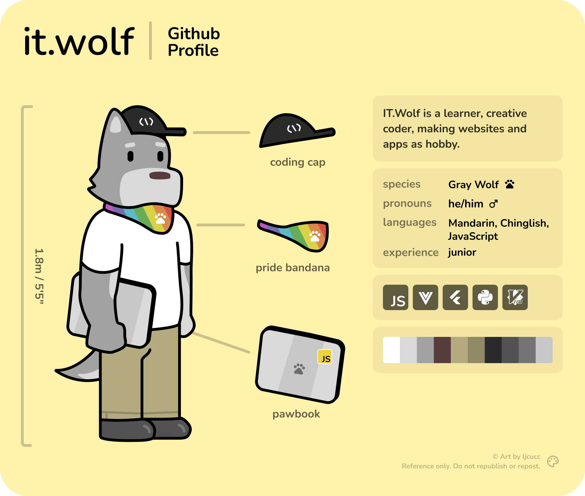

  
  
  

> I'm a wolf who love front end web dev & creative coding.

- `/` - [ljcu.cc](https://www.ljcu.cc)
- `/wiki` - [(www)iki](https://wiki.ljcu.cc)
- `/twitter/IRL` - https://twitter.com/ljcucc
- `/twitter/fursona` - https://twitter.com/the_ITWolf
- `/unsplash` - https://unsplash.com/@ljcucc

<!--
Easter eggs:

### State of me

**ljcucc/ljcucc** is a ✨ _special_ ✨ repository because its `README.md` (this file) appears on your GitHub profile.

Here are some ideas to get you started:

- 🔭 I’m currently working on ...
- 🌱 I’m currently learning ...
- 👯 I’m looking to collaborate on ...
- 🤔 I’m looking for help with ...
- 💬 Ask me about ...
- 📫 How to reach me: ...
- 😄 Pronouns: ...
- ⚡ Fun fact: ...
-->
