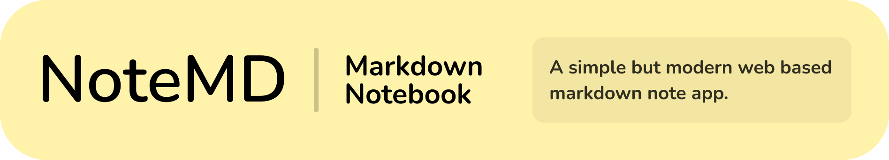

> A canine who <3 front end web dev & creative coding.

  <svg fill="none" xmlns="http://www.w3.org/2000/svg">
    <foreignObject width="100%" height="100%">
      

        

          
          
          
        

      

    </foreignObject>
  </svg>

<!--
Easter eggs:

### State of me

**ljcucc/ljcucc** is a ✨ _special_ ✨ repository because its `README.md` (this file) appears on your GitHub profile.

Here are some ideas to get you started:

- 🔭 I’m currently working on ...
- 🌱 I’m currently learning ...
- 👯 I’m looking to collaborate on ...
- 🤔 I’m looking for help with ...
- 💬 Ask me about ...
- 📫 How to reach me: ...
- 😄 Pronouns: ...
- ⚡ Fun fact: ...
-->
